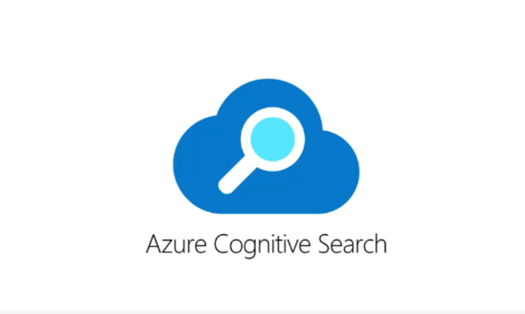
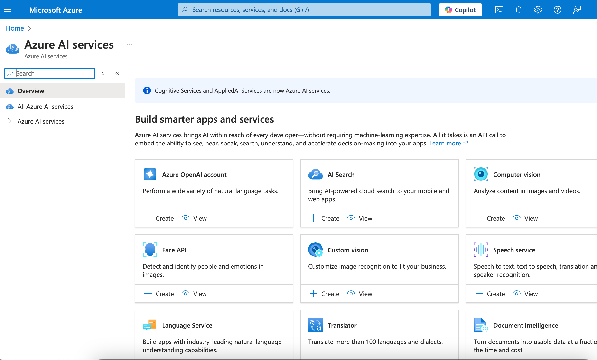
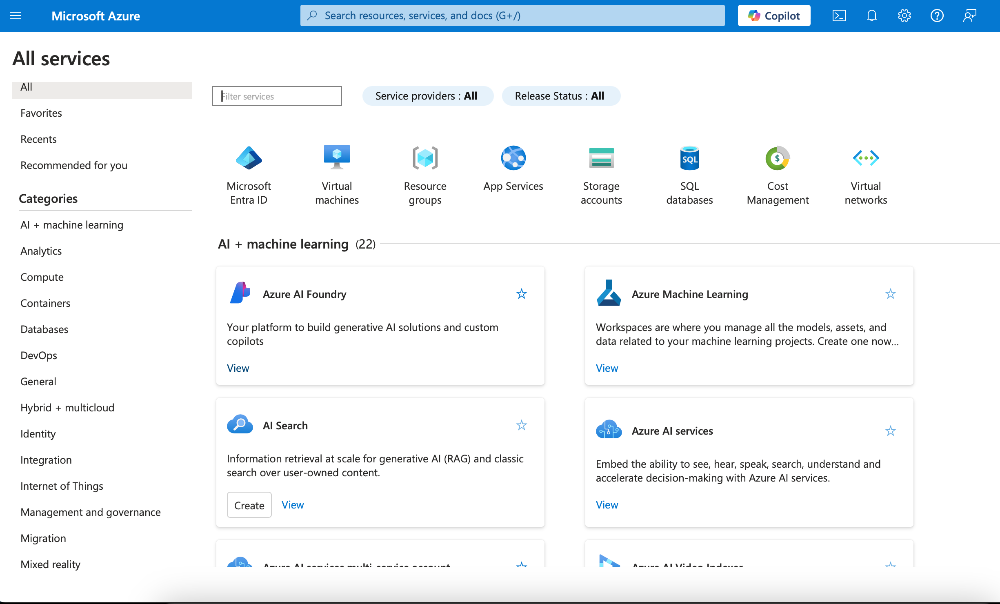
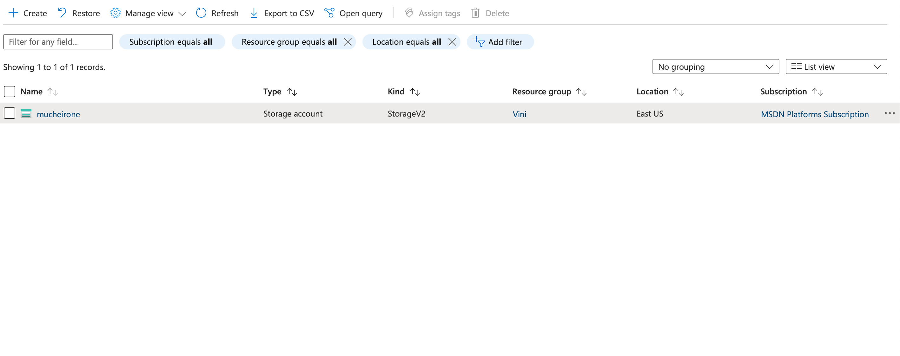
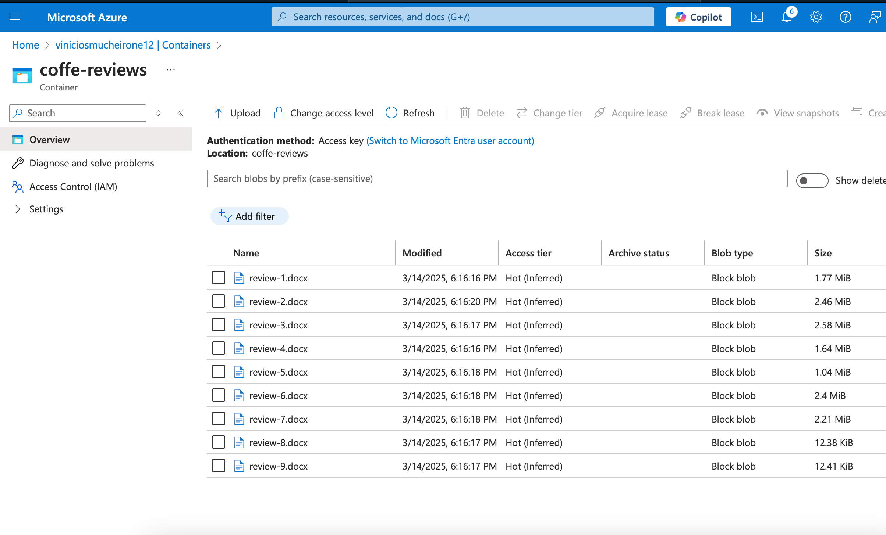
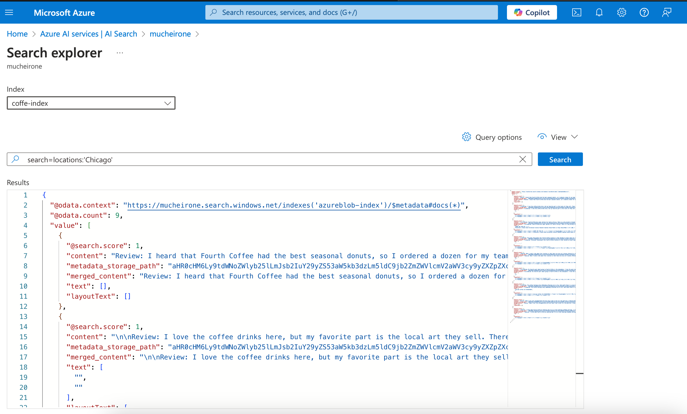
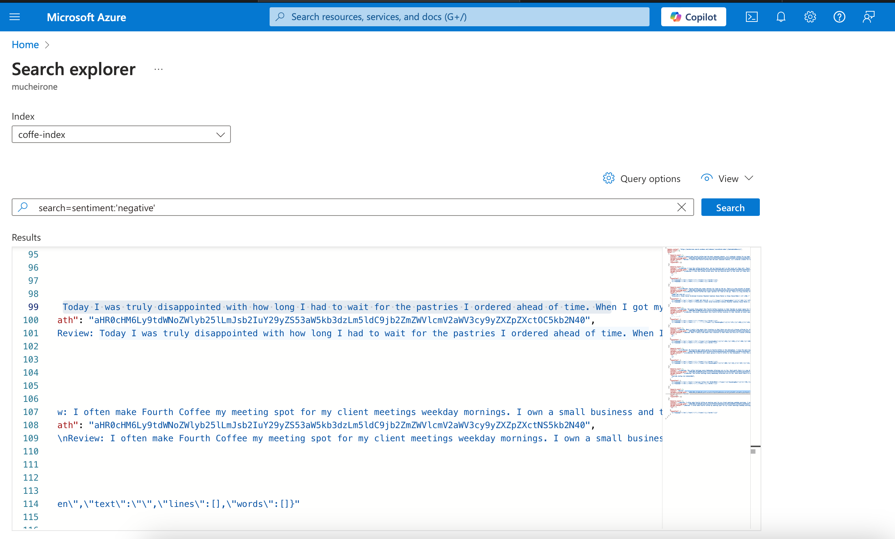
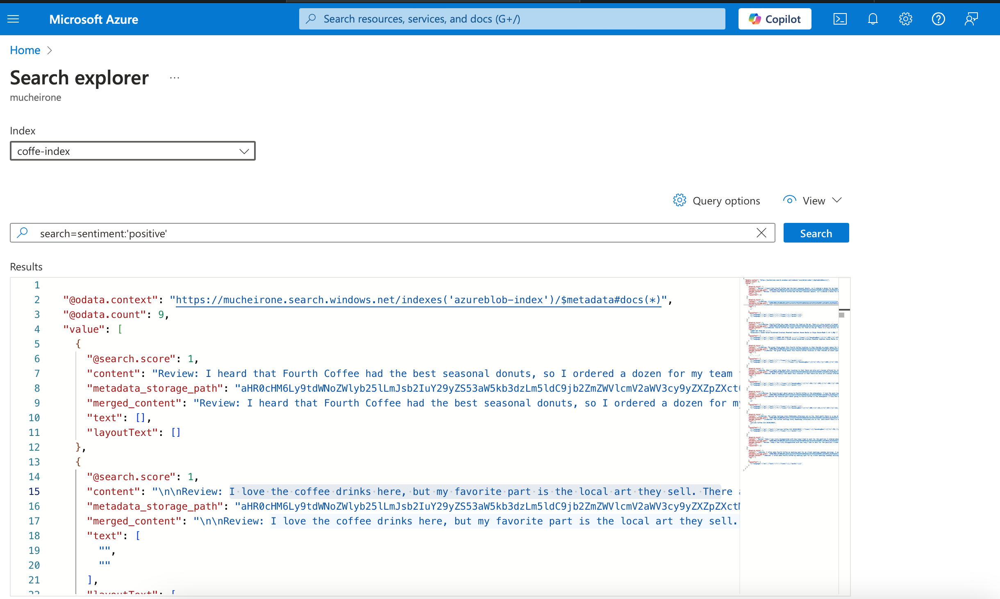

# Azure Cognitive Search: Utilizando AI Search para indexação e consulta de Dados 
<h1 align="center">
    

## Descrição do Projeto
 
 Esse projeto foi desenvolvido através do Azure Cognitive Search, onde ajudou a encontrar opiniões de clientes de uma cafeteria a respeito de seus serviços. Esse serviço do Azure, ajuda a encontrar informações rapidamente em documentos, bancos de dados e sites, utilizando a inteligência artifical para tornar a busca mais rápida e otimizada.
 
 

Serviços e ferramentas utilizadas no desenvolvimento desse projeto:

- Criação do azure AI Search, um serviço de busca inteligente que permite encontrar informações rapidamente em textos, imagens e áudios. Ele usa inteligência artificial para realizar esses processos;

- SERVIÇO DE IA, e AI+MACHINE LEARNING, usado para analisar dados, automatizar processos, criar previsões e melhorar a tomada de decisões em diversos setores;

- Storage Account, um serviço de armazenamento em nuvem que permite guardar e gerenciar dados estruturados e não estruturados, como arquivos, blobs, filas, tabelas e discos;

- O Azure Container Service, que ajudou a buscar dados do computador e levá-los para a nuvem, através do Azure Blob Storage.

##  Objetivos do Projeto:
O objetivo do Azure AI Search nesse projeto foi fazer a análise de comentários de clientes de uma cafeteria e, a partir disso, extrair insights valiosos a partir de avaliações e feedbacks, tanto positivos quanto negativos. Todos esses processos se deu de forma rápida, e otimizada, uma vez que a Inteligência Artifical é parte fundamental desse processo.

### Capturas de Tela da Execução do Projeto

 Capturas de tela que ilustram o funcionamento do Azure AI Search:

####  Criação do AL Search, através do Azure Al services
<h1 align="center">
    
</h1>

#### All services, selecionando a opção AI + Machine Learning
<h1 align="center"> 
    
</h1>

#### Storage Account, para o armazenamento de dados
<h1 align="center">
    
</h1>

#### Criação de um container chamado "coffe index" com o intuito de buscar dados do computador e levar para a nuvem do Azure
<h1 align="center">
    
</h1>

#### Search explorer para analisar os dados buscados anteriormente
<h1 align="center">
    
</h1>

####  Buscando sentimentos negativos das avaliações 
<h1 align="center">
    
</h1>

#### Buscando sentimentos positivos das avaliações
<h1 align="center">
    
</h1>

---

## Conclusão

O Azure Cognitive Search conseguiu analisar avaliações de consumidores para identificar tendências, sentimentos e informações úteis.
A Inteligência artificial é de suma importância nesse processo, pois realiza uma mineração nos dados encontrados, encontrando insights valiosos de dados estrurados e não estruturados.
Por fim, esse serviço mostra ser muito útil às empresas que desejam melhorar os seus resultados de uma forma rápida e otimizada, com o uso da Inteligência Artificial.